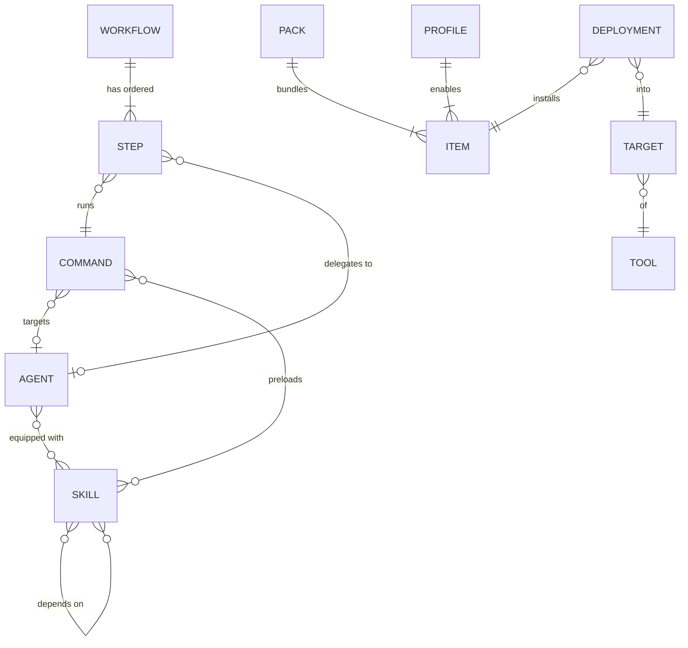

# 02 — Domain Model

This is the core of the concept. Current setups are messy because the entities exist but their **relationships don't**. AMC makes every relationship a first-class, declared, validated reference.

## 1. Entities at a glance



| Entity | One-line definition |
|--------|---------------------|
| **Skill** | A reusable capability: instructions, plus optional scripts and resources, loaded on demand |
| **Agent** | A persona: system prompt, tool permissions, model hint, and **equipped skills** |
| **Command** | A user-triggered entry point: a prompt template with arguments that can **target an agent** and **preload skills** |
| **Workflow** | An ordered or branching chain of **steps** that turns a multi-stage process into one runnable unit |
| **Item** | The umbrella term for any of the four entities above |
| **Tool** | A supported AI application (Claude Code, Codex CLI, …) |
| **Target** | A *tool + scope* pair, e.g. "Claude Code / Global" or "Cursor / Project `D:\work\api`" |
| **Deployment** | The record that an item (at a specific version) is installed into a target |
| **Profile** | A named set of enabled items, e.g. "Backend work" or "Writing mode", that can be switched on for a target |
| **Pack** | A shareable bundle of items plus their dependencies, with metadata |

## 2. Item identity & common fields

Every item has a folder in the library containing a manifest (`amc.yaml`) and content files.

```yaml
# amc.yaml — fields shared by all item kinds
id: skill.security-checklist      # stable, kind-prefixed, kebab-case; never changes on rename
kind: skill                       # skill | agent | command | workflow
name: Security Checklist          # display name (free to change)
slug: security-checklist          # used for file names and slash names when deployed
version: 1.3.0                    # semver; bumped on meaningful change
description: >                    # CRITICAL — many tools use this to decide when to auto-invoke
  Use when reviewing code for security issues: injection, authz, secrets, unsafe deserialization.
tags: [security, review]
author: Porhong
license: MIT
compat:                           # optional per-tool overrides / exclusions
  exclude: [gemini-cli]
  overrides:
    claude-code: { model: opus }
```

**Why IDs and not names?** Current setups link items by file name, so renaming a skill silently breaks every agent that mentions it. AMC references use the `id`. Renames are safe, and the compiler writes whatever file name each tool expects.

## 3. Skill

A skill is the smallest reusable unit of knowledge or procedure.

```
library/skills/security-checklist/
├── amc.yaml
├── SKILL.md              # main instructions (body only; frontmatter is generated)
├── references/           # optional docs the skill can point to
│   └── owasp-top10.md
└── scripts/              # optional helper scripts
    └── scan-secrets.ps1
```

Skill-specific manifest fields:

```yaml
kind: skill
entry: SKILL.md
triggers:                         # hints for "when to use" — compiled into description where tools need it
  - reviewing pull requests
  - touching auth code
dependsOn: [skill.code-reading-basics]   # other skills this one assumes
allowedTools: [Read, Grep, Bash]         # optional restriction, if the target supports it
scripts:
  trust: reviewed                        # untrusted | reviewed | owned — see Architecture §Security
```

**Rules**
- A skill never references an agent. Skills are leaves or depend only on other skills, which keeps the graph acyclic and reusable.
- `dependsOn` cycles are a validation error.

## 4. Agent

An agent is *who* does the work.

```
library/agents/code-reviewer/
├── amc.yaml
└── prompt.md             # system prompt body
```

```yaml
kind: agent
model: { preferred: opus, fallback: sonnet }  # abstract hint; adapters map to tool-specific values
tools:                                        # capability permissions (abstract names, mapped per tool)
  allow: [read, search, shell:readonly]
  deny: [write]
skills:                                       # ⭐ the key relationship — equipped skills
  - ref: skill.security-checklist
    mode: on-demand                           # on-demand | always (inline into prompt)
  - ref: skill.style-guide
    mode: always
delegatesTo: [agent.test-writer]              # optional: sub-agents this agent may hand off to
```

**Skill equip modes**
- `on-demand`: the skill stays a separate skill in tools that support skills natively. The agent prompt gets a short generated block such as "You have these skills available: …".
- `always`: the skill body is compiled into the agent's prompt. This suits small, essential rules. The compiler shows the resulting prompt size.

This replaces copy-paste. The skill lives in one place, and AMC produces the "inlined" or "referenced" form at deploy time for each tool.

## 5. Command

A command is *how the user starts* something.

```
library/commands/review-pr/
├── amc.yaml
└── template.md
```

```yaml
kind: command
arguments:
  - name: pr
    description: PR number or branch
    required: false
agent: agent.code-reviewer         # optional: run this command via this agent
preloadSkills: [skill.git-basics]  # optional: extra skills for this invocation
```

`template.md` uses one portable placeholder syntax, which adapters translate:

```markdown
Review pull request {{pr | default: "the current branch"}}.
Focus on correctness first, then security.
```

| Canonical | Claude Code | Codex prompts | Gemini CLI (TOML) |
|-----------|-------------|---------------|-------------------|
| `{{args}}` (all args) | `$ARGUMENTS` | `$ARGUMENTS` | `{{args}}` |
| `{{pr}}` (named / positional) | `$1` | `$1` / `$PR` | `{{args}}` + parsing instruction |

*(Exact syntax per tool is verified during adapter development; see [03](03-tool-adapters-and-deployment.md).)*

## 6. Workflow (the composition layer)

A workflow is the answer to "how do I combine agents and skills without making a mess". It chains commands and agents into a process, and AMC compiles it into artifacts each tool can run.

```yaml
kind: workflow
id: workflow.feature-delivery
name: Feature Delivery
entryCommand:                     # the workflow is invoked as its own slash command
  slug: ship-feature
  arguments: [{ name: ticket, required: true }]
steps:
  - id: plan
    agent: agent.planner
    skills: [skill.requirements-analysis]
    instruction: "Produce an implementation plan for {{ticket}}."
    output: plan                  # named handoff artifact
  - id: implement
    agent: agent.implementer
    input: [plan]
    instruction: "Implement the plan."
    gate: user-approval           # pause and ask the user before continuing
  - id: review
    command: command.review-pr    # reuse an existing command as a step
    onFail: { goto: implement, maxLoops: 2 }
  - id: summarize
    agent: agent.writer
    instruction: "Summarize the changes for the PR description."
```

**Step features**
- `agent` + `instruction`: delegate to an agent, with optional extra skills
- `command`: reuse an existing command as a step
- `input` / `output`: named handoffs between steps, compiled as "write to / read from" instructions or as sub-agent return values
- `gate`: `none | user-approval`
- `onFail`: simple loop-back with a cap. Arbitrary branching is out of scope for v1.

**How a workflow gets deployed.** No AI tool has a native "workflow" file format. AMC compiles workflows into things tools do support:

| Target capability | Compiled form |
|-------------------|---------------|
| Supports sub-agents (e.g. Claude Code) | Orchestrator command that delegates each step to the matching deployed sub-agent |
| Commands only, no sub-agents | One command with a numbered procedure. Agent personas get inlined as "Now act as …" sections and skill references become file paths |
| Rules/instructions only | A skill or rule file describing the procedure, plus a note in the deploy report that it isn't directly invocable |

The Composer UI shows each compiled form before deploy ([04](04-user-experience.md)).

## 7. Dependency resolution

Deploying any item deploys its **dependency closure**:

```
workflow.feature-delivery
 ├─ agent.planner ── skill.requirements-analysis
 ├─ agent.implementer ── skill.style-guide
 ├─ command.review-pr
 │    ├─ agent.code-reviewer ── skill.security-checklist ── skill.code-reading-basics
 │    └─ skill.git-basics
 └─ agent.writer
```

- The resolver computes the closure, detects cycles and missing refs, and warns about version conflicts.
- If an item is still needed by another deployed item, "Undeploy" asks before removing it (reference counting).

## 8. Scopes, Targets & precedence

| Scope | Meaning | Example path (Claude Code) |
|-------|---------|----------------------------|
| **Global** | Available to the tool everywhere for this OS user | `~/.claude/skills/…` |
| **Project** | Available only inside one project folder | `<project>/.claude/skills/…` |

AMC keeps a list of **registered projects**, added by the user or discovered by scanning for `.claude/`, `.cursor/`, `.github/` and similar folders. When the same slug exists at both scopes, the project copy usually wins in the tools themselves. AMC flags this as **shadowing** in the deployment matrix so users aren't surprised.

## 9. Profiles

A profile is a named on/off set of items for a target, e.g.:

- **"Deep work"**: planner, implementer, reviewer, plus core skills
- **"Minimal"**: only the style guide. Useful because every installed skill description costs context tokens in some tools.

Switching a profile on a target deploys and undeploys the difference. This addresses a real problem: people install everything globally and bloat every session's context.

## 10. Versioning & history

- The library folder is a **git repository**, created automatically. Every save is a commit (batched), so history, diffs, and restore come for free.
- Each deployment records the item `version` and **content hash** of what was written. Later changes on disk show up as drift ([03](03-tool-adapters-and-deployment.md)).
