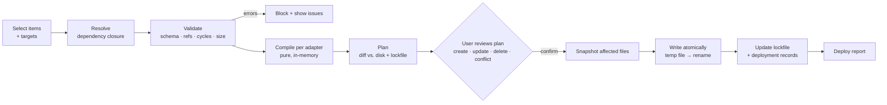

# 03 — Tool Adapters & Deployment

This document explains how one canonical library becomes native files for each AI tool, and how AMC does that **without ever destroying user work**.

## 1. The adapter model

Each supported tool has an **adapter** that implements the same interface:

```ts
interface ToolAdapter {
  id: string;                          // "claude-code", "codex-cli", ...
  displayName: string;
  detect(): Promise<ToolInstallInfo>;  // is it installed? where is its config dir? version?
  capabilities: CapabilityMatrix;      // what this tool natively supports (see §3)
  paths(scope: Scope): TargetPaths;    // where agents/skills/commands live for this scope
  scan(scope: Scope): Promise<ForeignItem[]>;             // read existing native files → import candidates
  compile(item: ResolvedItem, scope: Scope): CompiledFile[];  // canonical → native files (pure function)
  parse(files: NativeFile[]): CanonicalItemDraft;         // native → canonical (for import)
}
```

`compile` is a **pure function** (resolved item in, list of `{path, content}` out). That makes adapters easy to snapshot-test and lets the UI show an exact preview before anything touches disk.

## 2. Initial tool coverage

> ⚠️ AI tools change fast, so **each adapter's first task is to verify its paths and formats against the tool's current docs** and record the result in the adapter's `FORMAT.md`. Claude Code and Codex were verified on 2026-09-25 in Phase 0: see [claude-code/FORMAT.md](../../packages/adapters/claude-code/FORMAT.md) and [codex-cli/FORMAT.md](../../packages/adapters/codex-cli/FORMAT.md). The other rows are still assumptions.

| Tool | Agents | Skills | Commands | Global root | Project root | Priority |
|------|--------|--------|----------|-------------|--------------|----------|
| **Claude Code** ✅ | `agents/**/*.md` (YAML frontmatter) | `skills/<name>/SKILL.md` | `commands/**/*.md` | `~/.claude/` (`CLAUDE_CONFIG_DIR`) | `.claude/` | **P0** |
| **OpenAI Codex CLI** ✅ | `agents/*.toml` (native custom agents) | `~/.agents/skills/<name>/SKILL.md` (shared Agent Skills folder) | `prompts/*.md` (deprecated, global only) | `~/.codex/` (`CODEX_HOME`) | `.codex/agents/`, `.agents/skills/`, `AGENTS.md` | **P0** |
| **Gemini CLI** | *(verify: extensions / GEMINI.md)* | *(verify)* | `commands/*.toml` | `~/.gemini/` | `.gemini/` | P1 |
| **GitHub Copilot (VS Code)** | `agents/*.agent.md` *(verify)* | instructions files | `prompts/*.prompt.md` | VS Code user data | `.github/` | P1 |
| **Cursor** | modes *(verify)* | rules `*.mdc` | `commands/*.md` *(verify)* | `~/.cursor/` | `.cursor/` | P1 |
| **OpenCode** | `agent/*.md` | *(verify)* | `command/*.md` | `~/.config/opencode/` | `.opencode/` | P2 |
| **Generic / Custom** | user-defined folder + template | ← | ← | user-defined | user-defined | P2 |

The **Generic adapter** lets users point AMC at any folder with a filename pattern and a Handlebars-style template. It covers new or niche tools before a dedicated adapter exists.

## 3. Capability matrix & graceful degradation

Tools differ in what they can express. Every adapter declares a capability matrix:

```ts
type CapabilityMatrix = {
  agents: 'native' | 'none';
  subAgentDelegation: boolean;
  skills: 'native' | 'rules-only' | 'none';
  skillScripts: boolean;
  commands: 'native' | 'none';
  commandArgs: 'positional' | 'named' | 'whole-string' | 'none';
  toolPermissions: 'fine' | 'coarse' | 'none';
  modelSelection: boolean;
};
```

When a canonical feature has no native equivalent, the compiler applies a **degradation strategy** and **records it in the deploy report**:

| Canonical feature | Tool lacks it → strategy |
|-------------------|--------------------------|
| Agent | Emit as a command, "Act as <persona>: …", or as a rules/instructions file |
| Skill (on-demand) | Emit as a rules file with the description as its activation hint, or inline into dependent agents/commands |
| Agent → skill link | Add a generated "Available skills" block that lists paths to the deployed skill files |
| Named command args | Convert to whole-string args plus a parsing instruction in the prompt |
| Tool permissions | Drop and **warn**. Never silently widen permissions without telling the user |
| Model hint | Map through the adapter's model table, or drop and warn |
| Workflow | Compile per [02 §6](02-domain-model.md#6-workflow-the-composition-layer) |

Degradations show up as badges in the UI, e.g. **"⚠ 2 adaptations"** on a target card, and users can expand each one.

## 4. Deployment pipeline



**The plan step is mandatory.** Like `terraform plan`, the user always sees what will be created, updated, or deleted, and any **conflicts**, before AMC writes anything. Power users can enable "auto-apply when no conflicts" for routine syncs.

## 5. Ownership: the lockfile

AMC writes a lockfile in each target root it manages, e.g. `~/.claude/.amc-lock.json`:

```json
{
  "amcVersion": "0.1.0",
  "target": "claude-code:global",
  "files": {
    "skills/security-checklist/SKILL.md": {
      "itemId": "skill.security-checklist",
      "itemVersion": "1.3.0",
      "sha256": "9f2c…",
      "deployedAt": "2026-09-25T09:40:00Z"
    }
  }
}
```

A mirror of this data also lives in AMC's own database, so ownership can be recovered if the lockfile is deleted. Rules:

1. **Files in the lockfile are owned by AMC.** AMC may update or delete them.
2. **Files not in the lockfile are foreign.** AMC never modifies or deletes them. It can offer to **adopt** them (import into library → take ownership).
3. If a planned write hits a foreign file with the same path, that's a **conflict**. The user picks one of: *adopt & replace*, *rename AMC's output*, or *skip*.

## 6. Drift detection

A file watcher (plus a periodic re-scan) compares owned files against their lockfile hash:

| State | Meaning | Offered actions |
|-------|---------|-----------------|
| ✅ **In sync** | Disk matches last deploy, library unchanged | — |
| 🔵 **Outdated** | Library has a newer version than what's deployed | Deploy update |
| 🟠 **Drifted** | Someone (user, the AI tool, another script) edited the deployed file | **Pull back** into library (3-way diff) · **Overwrite** with library version · **Detach** (make foreign) |
| 🔴 **Missing** | Owned file was deleted outside AMC | Redeploy · Forget |
| ⚪ **Foreign** | Unmanaged file found in a target folder | Adopt · Ignore |

"Pull back" matters because AI tools and users often tweak a deployed file directly. AMC turns that edit into a library change through a **3-way merge** (last deployed ↔ current disk ↔ current library) instead of fighting it.

## 7. Import (first-run and ongoing)

1. **Detect tools:** each adapter's `detect()` runs to find installed tools and their config roots.
2. **Scan:** `scan()` runs for the global scope and every registered project.
3. **Parse & normalize:** each native file becomes a canonical draft. Frontmatter is mapped to canonical fields, and unknown fields are kept in `compat.overrides.<tool>.raw` so nothing is lost.
4. **Deduplicate:** the same skill often exists in several tools. AMC groups candidates by slug plus content similarity and offers to merge them into **one library item with multiple deployments**.
5. **Infer relationships:** AMC suggests links when an agent prompt mentions a skill name or a command mentions an agent, e.g. "`code-reviewer` mentions `security-checklist`. Link as equipped skill?" The user confirms each one, and AMC never links automatically.
6. **Adopt:** accepted items enter the library, and their existing files are recorded in the lockfile **as-is**. Nothing on disk is rewritten until the user deploys.

## 8. Symlink vs. generated copy

| Strategy | Pros | Cons | Use when |
|----------|------|------|----------|
| **Generated copy** (default) | Works everywhere, supports per-tool compilation, safe on Windows | Needs AMC to resync | Almost always |
| **Symlink / junction** | Edits propagate instantly | Needs Windows Developer Mode or admin for symlinks; can't compile per tool; some tools ignore symlinks | Only for skills whose native format matches canonical exactly, and only if the user opts in |

## 9. Rollback

- Before each apply, AMC **snapshots** every file it will modify or delete into `~/.amc/snapshots/<deploy-id>/`.
- The **Deploy History** screen lists deployments, and each one has a **Revert**.
- Snapshots are pruned by age and count (configurable; default: keep the last 50 deploys or 30 days).
