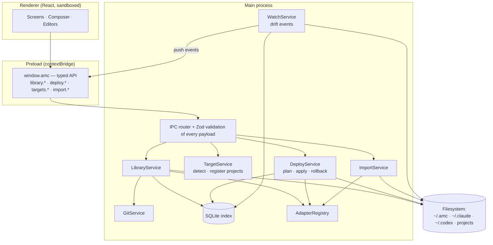
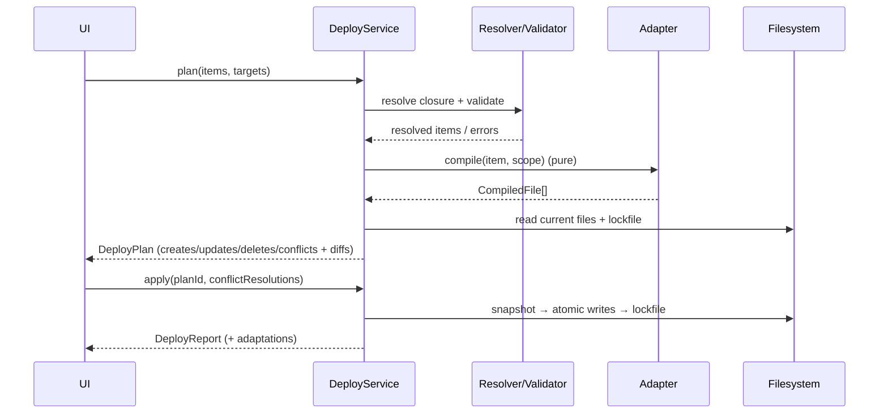

# 05 — Architecture

## 1. Technology choices

| Layer | Choice | Rationale |
|-------|--------|-----------|
| Shell | **Electron** (latest stable) | Cross-platform desktop with full filesystem access; Windows is the first platform, macOS/Linux follow |
| Build | **electron-vite** + **electron-builder** | Fast HMR, clean main/preload/renderer split, installers + auto-update |
| Language | **TypeScript** (strict) everywhere | Shared types across processes |
| UI | **React** + **Tailwind** + component kit (e.g. shadcn/ui on Radix) | Mature, accessible primitives |
| State | **TanStack Query** (IPC data) + **Zustand** (UI state) | Clear split between server-like and local state |
| Editor | **Monaco** | Markdown/YAML editing, diff viewer, 3-way merge view |
| Graph canvas | **React Flow** (@xyflow/react) | Composer and relation graphs |
| Schema/validation | **Zod** | One schema → runtime validation + TS types + JSON Schema for YAML editor hints |
| Index DB | **SQLite** via better-sqlite3 (FTS5 for search) | Fast queries and search; *rebuildable cache*, not source of truth |
| File watching | **chokidar** (or `@parcel/watcher`) | Drift detection on target folders + library |
| Git | **isomorphic-git** or system git via `simple-git` | Library history without requiring git installed (isomorphic-git) |
| Frontmatter / YAML | `gray-matter`, `yaml`; `@iarna/toml` for Gemini | Native format parsing |
| Testing | Vitest (core + adapter snapshot tests), Playwright for Electron (E2E) | |

## 2. Package layout (monorepo)

```
agent-management-commander/
├── apps/
│   └── desktop/                 # Electron app
│       ├── src/main/            # main process: services, IPC handlers
│       ├── src/preload/         # typed, minimal bridge (contextBridge)
│       └── src/renderer/        # React UI
├── packages/
│   ├── core/                    # ⭐ pure TS domain logic — no Electron imports
│   │   ├── model/               # Zod schemas: Agent, Skill, Command, Workflow, Pack…
│   │   ├── library/             # read/write library folder, git history
│   │   ├── resolver/            # dependency closure, cycle detection
│   │   ├── validator/           # lint rules
│   │   ├── compiler/            # workflow compilation, template translation
│   │   ├── deployer/            # plan / apply / lockfile / snapshots / rollback
│   │   └── drift/               # hash comparison, 3-way merge helpers
│   ├── adapters/                # one folder per tool, each implements ToolAdapter
│   │   ├── claude-code/
│   │   ├── codex-cli/
│   │   ├── gemini-cli/
│   │   ├── copilot/
│   │   ├── cursor/
│   │   ├── opencode/
│   │   └── generic/
│   └── cli/                     # `amc` CLI reusing core + adapters (phase 3)
└── docs/
```

**Key rule:** `core` and `adapters` never import Electron. That keeps them unit-testable and lets the **CLI reuse them unchanged**. With the CLI, AI agents themselves can call `amc deploy …` or `amc list skills` from a terminal.

## 3. Process model



- **Renderer** has no Node access (`contextIsolation: true`, `nodeIntegration: false`, `sandbox: true`).
- **Preload** exposes a narrow, typed API. There's no generic "read any file" channel.
- **Main** validates every IPC payload with Zod and runs all filesystem work. Heavy scans run in a **utility process / worker thread** so the UI never freezes.
- Events (drift detected, scan progress, deploy progress) are **pushed** to the renderer over a subscription channel.

## 4. On-disk layout

```
~/.amc/                              # AMC home (configurable)
├── library/                         # ⭐ source of truth — a git repo
│   ├── agents/<slug>/amc.yaml + prompt.md
│   ├── skills/<slug>/amc.yaml + SKILL.md + references/ + scripts/
│   ├── commands/<slug>/amc.yaml + template.md
│   ├── workflows/<slug>/amc.yaml (+ layout.json for canvas positions)
│   └── profiles/<name>.yaml
├── state/
│   ├── index.sqlite                 # rebuildable cache: items, relations, deployments, FTS
│   ├── targets.json                 # registered projects, custom generic targets
│   └── settings.json
├── snapshots/<deploy-id>/…          # pre-deploy backups for rollback
└── logs/
```

Target folders get only the compiled files plus `.amc-lock.json`.

**If `index.sqlite` is deleted**, AMC rebuilds it from `library/` plus the lockfiles. Nothing is lost, because the index is only a cache.

## 5. Core flows (sequence)

### Deploy


The plan carries a hash of every file it read. If disk changed between plan and apply, the apply is rejected and the plan recomputed, which prevents race conditions.

## 6. Validation rules (initial set)

| Rule | Severity |
|------|----------|
| Manifest matches schema | error |
| Every `ref` resolves to an existing item | error |
| No dependency cycles | error |
| Slug unique per kind | error |
| Slug valid for every target tool's naming rules | error (per target) |
| Description present and ≥ 20 chars | warning (tools rely on it for auto-invocation) |
| Description ≤ tool limit | warning / error per adapter |
| Inlined prompt size > threshold | warning |
| Skill scripts present with trust `untrusted` | warning; blocks deploy by default |
| Unused item (not deployed, not referenced) | info |

## 7. Security model

AMC writes files that shape what AI agents do, and skills can contain **executable scripts**. Security is therefore central to the design:

1. **Least-privilege Electron:** sandboxed renderer, strict CSP, no remote content, no `shell.openExternal` for unvalidated URLs, IPC allow-list.
2. **Script trust levels** for skills: `untrusted` (imported from pack or URL) → `reviewed` (user read and approved in the UI) → `owned` (authored locally). Untrusted scripts aren't deployed without explicit approval, and the review screen shows the full script content.
3. **Pack imports** show a manifest summary (items, scripts, requested tool permissions such as "shell: unrestricted") before install. They never auto-execute anything.
4. **Permission-widening warnings:** if an edit or import widens an agent's `tools.allow` (e.g. adds unrestricted shell), the deploy plan highlights it.
5. **No secrets in the library.** A validator scans for key-like strings (API keys, tokens) and warns, since the library is a git repo that users may push.
6. **Path safety:** all compiled output paths are normalized and must stay inside the target root, which blocks path traversal via crafted slugs.
7. **Code signing** for release builds (Windows Authenticode, macOS notarization) and signed auto-updates.

## 8. Cross-platform notes

- Resolve home and config paths per OS (`%USERPROFILE%`, `~/Library/Application Support`, XDG dirs). Adapters own their own path logic.
- Windows: handle long paths, CRLF vs LF (preserve the existing file's line endings on update; default LF), and file locks (retry with backoff).
- Symlinks are opt-in only (see [03 §8](03-tool-adapters-and-deployment.md#8-symlink-vs-generated-copy)).

## 9. Extensibility

- **Adapters as plugins (v2):** load third-party adapters from `~/.amc/adapters/` with the same `ToolAdapter` interface, sandboxed and declared via manifest.
- **Templates:** item templates are themselves library items (`kind: template`), so users can share them in packs.
- **CLI (`amc`)** and, later, an **MCP server** that exposes the library (e.g. `list_skills`, `get_skill`, `deploy`), so AI agents can query and manage their own toolbox through AMC.
