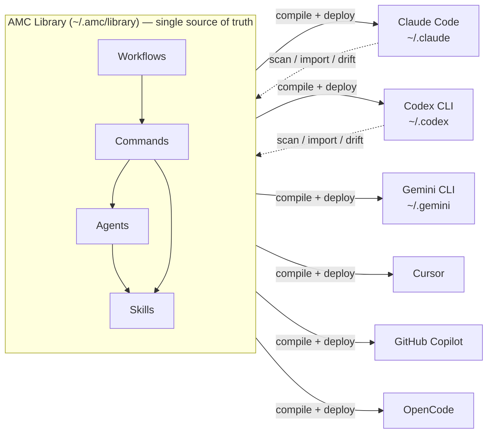

# Agent Management Commander (AMC) — Concept Docs

> **Status:** Concept / pre-implementation · **Date:** 2026-09-25 · **Owner:** Porhong

AMC is an Electron desktop app for creating, composing, and managing **agents**, **skills**, and **commands**, which it combines into **workflows**. You keep one library on your PC, and AMC deploys it to every AI coding tool you have installed (Claude Code, Codex CLI, Gemini CLI, Cursor, GitHub Copilot, OpenCode, …), at global or project scope.

The core idea fits in one sentence:

> **Write once, compose visually, deploy everywhere, and always know what's installed where.**

## Reading order

| # | Document | What it answers |
|---|----------|-----------------|
| 01 | [Vision & Problem](01-vision-and-problem.md) | Why AMC exists, who it's for, what "success" means |
| 02 | [Domain Model](02-domain-model.md) | The building blocks (Agent, Skill, Command, Workflow, Target, Deployment) and how they relate |
| 03 | [Tool Adapters & Deployment](03-tool-adapters-and-deployment.md) | How one canonical library becomes native files for each AI tool, and how AMC avoids breaking things |
| 04 | [User Experience](04-user-experience.md) | Screens, key journeys, the visual composer |
| 05 | [Architecture](05-architecture.md) | Electron process layout, services, storage, security |
| 06 | [Roadmap & Open Questions](06-roadmap-and-open-questions.md) | Phased delivery plan, risks, decisions still to make |
| — | [Glossary](glossary.md) | Every term in one place |

## One-screen summary

## Design principles (short form)

1. **The library is the source of truth.** Tool folders like `~/.claude` hold build output.
2. **Relationships are explicit.** An agent *declares* its skills and a command *declares* its agent. Nothing depends on naming conventions or copy-pasted text.
3. **Files first, database second.** Everything is plain Markdown/YAML on disk, git-friendly, and readable without AMC. The database is a rebuildable index.
4. **Never destroy user work.** AMC only overwrites files it owns (tracked in a lockfile). It adopts foreign files explicitly and makes changes reversibly.
5. **Show degradation honestly.** When a target tool can't do something (e.g. no sub-agents), AMC says so and shows exactly how it adapted the output.
6. **Tool-agnostic core, tool-specific adapters.** New AI tools arrive often, so adding one means adding one adapter.
