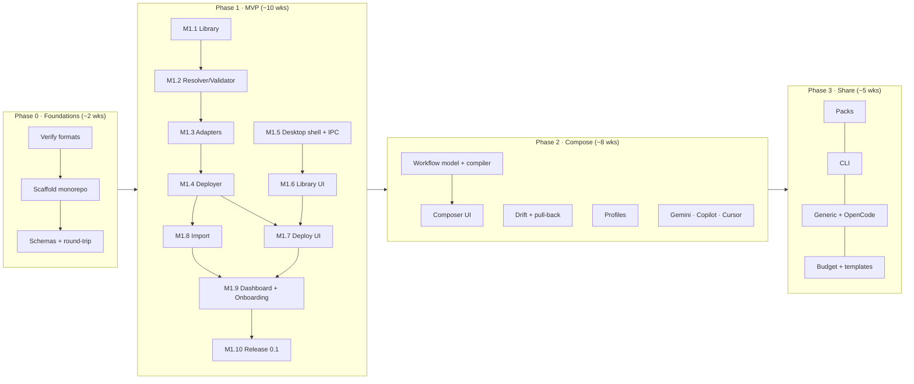

# AMC — Implementation Plan

This plan turns the [concept docs](../concept/README.md) into buildable work. It is organized by phase. Each phase is split into **milestones**, and each milestone into **tasks** with IDs, deliverables, and acceptance criteria.

| Document | Scope |
|----------|-------|
| [phase-0-foundations.md](phase-0-foundations.md) | Format verification, monorepo scaffold, schemas, round-trip proof |
| [phase-1-mvp.md](phase-1-mvp.md) | Library, Claude Code + Codex adapters, deploy pipeline, import, core UI, first release |
| [phase-2-compose.md](phase-2-compose.md) | Workflows + Composer, drift & pull-back, profiles, 3 more adapters |
| [phase-3-share-and-extend.md](phase-3-share-and-extend.md) | Packs, `amc` CLI, Generic/OpenCode adapters, context budget, templates |
| [engineering-practices.md](engineering-practices.md) | Repo conventions, testing strategy, CI/CD, safety invariants, definition of done |

## 1. Decisions assumed by this plan

The plan adopts the "leaning" answers from [concept 06 §3](../concept/06-roadmap-and-open-questions.md#3-open-questions-decisions-needed). If you change one, the affected tasks are listed so you can re-plan them.

| # | Assumed decision | Tasks affected if changed |
|---|------------------|---------------------------|
| Q1 | Skill = `SKILL.md` body + `amc.yaml` sidecar | P0-05, P0-06, M1.1, all adapters |
| Q2 | Library at `~/.amc/library`, changeable at onboarding | M1.9 |
| Q3 | isomorphic-git by default; system git optional later | M1.1 (T1.1.5) |
| Q4 | Workflows deploy to weaker tools in degraded form, labeled "Adapted" | M2.2 |
| Q5 | shadcn/ui + Tailwind | P0-03, all UI milestones |
| Q6 | **Open, owner decision.** It blocks only the public release (M1.10) | M1.10 |
| Q7 | Project libraries are deferred to Phase 2 (M2.6) | M2.6 |
| Q9 | Auto-apply is a per-target setting, default "ask" | M1.7 |

## 2. Delivery overview

Estimates are **ideal person-weeks for one full-time developer** familiar with TypeScript and Electron. Add about 30% for a part-time or less experienced setup.

| Phase | Estimate | Release |
|-------|----------|---------|
| 0 — Foundations | 1.5–2 wks | (internal) |
| 1 — MVP | 9–11 wks | **v0.1.0** (Windows first) |
| 2 — Compose | 7–9 wks | **v0.2.0** (+ macOS/Linux builds) |
| 3 — Share & extend | 4–6 wks | **v0.3.0** |

## 3. Critical path and parallel tracks

The **critical path** is: schemas → library → resolver → adapters → deployer → deploy UI → release. Everything that can safely write into `~/.claude` depends on the deployer, so it gets the most test investment.

The work can run on two parallel tracks if there are two developers:

| Track A: Core (pure TS, no Electron) | Track B: App (Electron + UI) |
|--------------------------------------|------------------------------|
| P0-04…P0-07, M1.1–M1.4, M1.8 core | P0-03, M1.5, M1.6, M1.7, M1.9 |
| Works against fixtures and an in-memory FS | Works against a **mock `window.amc` API** until core lands |

The seam between the tracks is the **IPC contract** (`apps/desktop/src/shared/ipc-contract.ts`, task T1.5.2). Define it early and change it deliberately.

## 4. Task ID convention

- `P0-NN`: Phase 0 task
- `T<phase>.<milestone>.<n>`, e.g. `T1.4.3`: a task inside a milestone
- Each task has **Deliverables** (files or behavior) and **Acceptance** (verifiable checks). A task is done only when it meets the [definition of done](engineering-practices.md#8-definition-of-done).

## 5. Top risks to watch during implementation

| Risk | Early signal | Response |
|------|--------------|----------|
| Codex (or another tool) format differs from assumptions | P0-01 findings | Adjust the capability matrix and degradations *before* M1.3; don't bend the canonical model |
| ~~Native module pain (better-sqlite3 in Electron)~~ | **Happened in P0-03, now resolved** | Switched to the built-in `node:sqlite` (FTS5 verified in the packaged app). The index still sits behind an `IndexStore` interface |
| Deployer bug overwrites user files | Any failing safety test | Stop the line. Safety invariants ([engineering-practices §5](engineering-practices.md#5-safety-invariants-must-never-break)) block merge |
| UI scope balloons | M1.6 over estimate by >50% | Ship forms + raw mode first; defer the relations mini-graph to Phase 2 |
