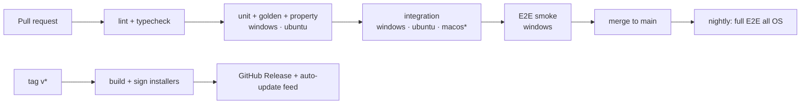

# Engineering Practices

These rules apply to every phase.

## 1. Repository conventions

| Area | Convention |
|------|------------|
| Package manager | pnpm workspaces. Node 22 LTS pinned in `.nvmrc` and `engines` |
| Language | TypeScript `strict`, `noUncheckedIndexedAccess`, ESM everywhere |
| Boundaries | `packages/*` never import `electron` or anything from `apps/*` (lint-enforced). `adapters/*` depend only on `core` |
| Naming | Files are `kebab-case.ts`. Types are `PascalCase`. Item IDs are `kind.slug` |
| Errors | Core returns typed `AmcError { code, message, details }` values for expected failures and throws only for bugs. Error codes are listed in `core/src/errors.ts` |
| Commits | Conventional Commits (`feat(core): …`, `fix(adapter-claude): …`). Squash-merge PRs |
| Branches | `main` is always releasable. Feature branches are `feat/<task-id>-short-name`, e.g. `feat/T1.4.5-atomic-apply` |
| Formatting | Prettier with default settings plus `printWidth: 100`, checked in CI |

## 2. Code layout inside `packages/core`

```
packages/core/src/
├── errors.ts
├── fs/          # FsPort, NodeFs, MemFs, atomic write, hashing
├── model/       # Zod schemas + inferred types
├── library/     # item IO, LibraryService, GitService, templates
├── graph/       # reference graph, closure, cycles
├── validate/    # rule framework + rules
├── adapter/     # ToolAdapter SDK, registry, degradation helpers
├── compile/     # template translation, workflow compilers
├── deploy/      # plan, apply, lockfile, journal, snapshots, rollback
├── drift/       # status computation, merge3, reverse mapping
├── import/      # scan orchestration, dedupe, suggestions, adopt
├── pack/        # (phase 3)
└── index.ts     # public API — the ONLY import path for app & CLI
```

The services are plain classes constructed with their ports (`FsPort`, `IndexStore`, `Clock`, `Logger`). The app and the CLI both wire them together in a small `createAmc(config)` factory.

## 3. Testing strategy

| Layer | Tool | What | Target |
|-------|------|------|--------|
| Unit | Vitest | Schemas, graph, validator rules, helpers | Fast (<10s in total) |
| Adapter golden | Vitest snapshots | `compile(fixture)` → files, and `parse(native)` → canonical | Every fixture item for every adapter. Snapshot changes need reviewer sign-off |
| Round-trip | Vitest | `compile(parse(x)) ≈ x` over `fixtures/<tool>/` | Per adapter |
| Property | fast-check | Item IO idempotence, deploy invariants over random sequences of edits and deploys | See §5 |
| Integration | Vitest + real temp dirs | Deployer against `NodeFs` in a temp `HOME`, including Windows `EBUSY` simulation | Windows and Linux CI |
| IPC | Vitest | Contract validation: invalid payloads rejected, errors serialized | Every channel |
| E2E | Playwright `_electron` | User journeys J1–J6 with an isolated `HOME`/`USERPROFILE` | Per phase exit |

**Fixtures** live in `fixtures/<tool>/{global,project}/…`. They mimic real folders and include foreign files, CRLF files, unicode names, and deep nesting. There's also an opt-in, read-only `AMC_REAL_HOME=1` test mode for running against the developer's real setup.

**Test isolation:** tests never touch the real `~` unless `AMC_REAL_HOME=1` is set, and even then they only read. A test helper overrides `os.homedir()` and the environment variables.

## 4. CI/CD


\* macOS joins in Phase 2.

- Cache the pnpm store and Electron binaries.
- Signing secrets are available only to the tag workflow.
- Every release attaches a `CHANGELOG.md` excerpt and a SHA-256 of each artifact.

## 5. Safety invariants (must never break)

These rules come from the core promise, "never lose a file". Each one is tested by property-based tests (random sequences of create, edit, deploy, manual edit, delete, and rollback against `MemFs`) **and** by integration tests. A failure blocks merging.

| # | Invariant |
|---|-----------|
| S1 | AMC never writes, renames, or deletes a path that isn't in the lockfile, unless the user resolved a conflict for that exact path in the applied plan |
| S2 | Every modified or deleted file is in the deploy snapshot before the first write |
| S3 | `rollback(d)` restores every path touched by deploy `d` byte-for-byte (unless a later deploy touched it, in which case rollback is refused with an explanation) |
| S4 | No write happens outside the target root (after `realpath` normalization, junctions and symlinks included) |
| S5 | Apply with stale `readHashes` performs zero writes |
| S6 | Import/adopt performs zero writes to target folders |
| S7 | In managed shared files (`AGENTS.md` etc.), bytes outside AMC markers are preserved exactly |
| S8 | An interrupted apply is always detectable (journal) and recoverable to either the pre-deploy or the post-deploy state |

## 6. Security checklist (per release)

- [ ] Electron: `contextIsolation`, `sandbox`, no `nodeIntegration`, CSP, navigation blocked, `setWindowOpenHandler` denies, no `remote`
- [ ] IPC: every channel is in the contract and Zod-validated. No generic fs channel
- [ ] Paths from the renderer are only dialog-issued tokens or registered target IDs
- [ ] Pack import: zip-slip test, script review, trust reset on hash change
- [ ] Secret scanner on the library and on pack export
- [ ] Dependency audit (`pnpm audit`) with no high or critical issues. Electron is on a supported major version
- [ ] Signed binaries and a signed update feed

## 7. Performance budgets

| Scenario | Budget |
|----------|--------|
| Cold start to interactive (500 items) | < 2.5s |
| Compiled preview refresh | < 500ms |
| Plan for 50 items × 4 targets | < 1s |
| Full index rebuild, 1,000 items | < 5s (in the background) |
| Idle CPU with watchers | ~0% |

## 8. Definition of done

A task is done when:

1. The code is merged to `main` with CI green (lint, types, and every relevant test layer).
2. Acceptance criteria are verified by automated tests where feasible. Manual checks are listed in the PR.
3. Golden and snapshot updates were reviewed on purpose, not blindly updated.
4. User-facing behavior is reflected in the concept docs if it changed, and `CHANGELOG.md` has an entry.
5. Any safety-relevant code (deploy, import, drift, pack) has a test tied to an invariant from §5.
